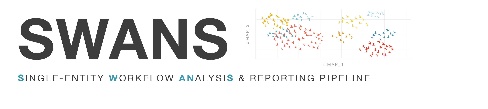

# SWANS Vignettes 

SWANS (Snakemake Workflow for Analysis of Nucleotide Sequences) is a configurable
scRNA-seq/snRNA-seq analysis pipeline built on Snakemake, Cell Ranger, and Seurat, with
multi-schema clustering comparison and collaborator-friendly interactive reporting. These
vignettes walk through a full worked example — GSE191288 / PRJNA790856 (Wang et al. 2022,
bilateral papillary thyroid carcinoma) — from raw data to a fully annotated,
condition-compared analysis.

## Vignettes

1. **[SWANS Tutorial: Preliminary Analysis](SWANS_Vignette_1_Preliminary_Analysis.md)**
   Raw input data (FASTQ, Cell Ranger output, or feature-barcode matrices) through the
   preliminary Snakemake pass, QC report, and the interactive Shiny report used to compare
   normalization/integration/resolution schemas side by side. Ends at the point where
   you've chosen one schema and are ready to annotate it.

2. **[SWANS Tutorial: Post-Annotation Analysis](SWANS_Vignette_2_Post_Annotation_Analysis.md)**
   Continues directly from Vignette 1: building the `CLUSTER_ANNOTATION_FILE`, running the
   post-annotation pipeline pass, and interpreting the resulting report — differential
   expression across experimental conditions, GSEA, z-scores, and optional trajectory
   analysis.

3. **[Evaluating Schema Robustness and Cluster Stability](evaluating-schema-robustness-and-stability.md)**
   A standalone validation toolkit, run independently of the core pipeline: automated
   cross-schema cluster matching and gene-signature (marker) Jaccard concordance across
   your full schema grid, plus subsampling-based cluster stability for one chosen schema —
   with or without a completed cell-type annotation.

## Suggested order

Read Vignettes 1 and 2 in order — they're a continuous worked example. Vignette 3 is
optional and self-contained, but if your goal is **schema-selection assistance**, the
most useful point to run it is *between* 1 and 2: after the preliminary pass has produced
your full schema grid, but before you commit to annotating one schema and moving into
post-annotation analysis. Vignette 1 links to it at exactly that point (end of Section
11, "Next steps").

